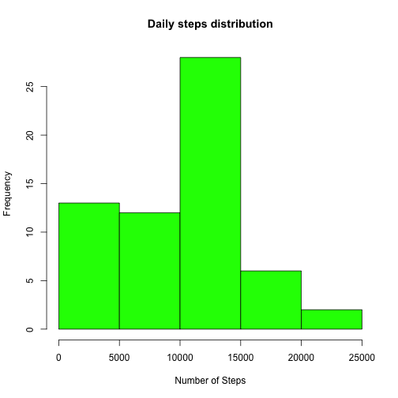
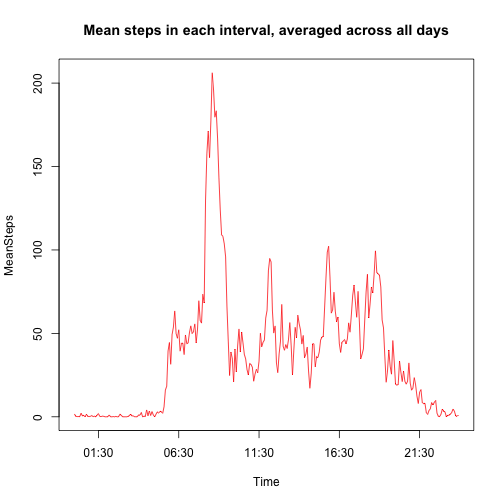
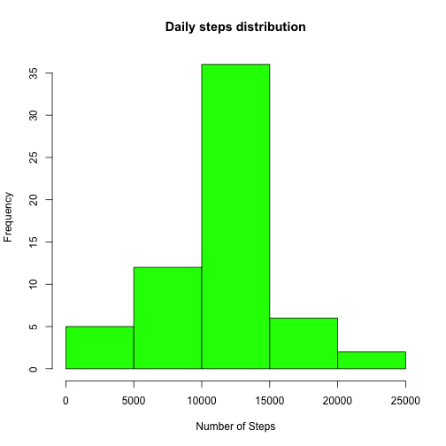
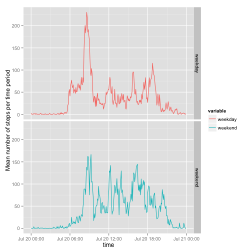

# Reproducible Research: Peer Assessment 1


## Loading and preprocessing the data

There is an assumption that the required file
(activity.zip) is present in the working directory.  


```r
unzip("activity.zip")
data <- read.csv("activity.csv")
#Break the data down into a summary of number of steps for each day.
dailySteps <- tapply(data$steps, data$date, FUN=sum, na.rm=TRUE)
```


## What is mean total number of steps taken per day?


```r
hist(dailySteps, 
     col="green", 
     xlab="Number of Steps", 
     main="Daily steps distribution")  
```

 

The above plot shows the distribution of number of steps each day. Analysis of the distribution (mean, median), is below.  

```r
mean( dailySteps )
```

```
## [1] 9354
```

```r
median( dailySteps )
```

```
## [1] 10395
```


## What is the average daily activity pattern?


```r
intervalSteps <- tapply(data$steps, data$interval, FUN=mean, na.rm=TRUE)
#Get the times in a more useful format
times <- sprintf( "%04s", names(intervalSteps))
times <- strptime(times, format="%H%M")
intervalSteps <- data.frame(intervalSteps, times)
colnames(intervalSteps) <- c("MeanSteps", "Time")
with(intervalSteps,
    plot(Time, MeanSteps,
         type="l",
         col="red",
         main="Mean steps in each interval, averaged across all days")
    )
```

 

What time of day has the greatest mean number of steps (5 min window)?

```r
maxSteps <- max(intervalSteps$MeanSteps)
maxTime <- intervalSteps[intervalSteps$MeanSteps==maxSteps,]$Time
as.character(maxTime, format="%H:%M")
```

```
## [1] "08:35"
```

## Imputing missing values

Total number of NA values (for steps) in the dataset

```r
sum( is.na( data$steps ))
```

```
## [1] 2304
```

To fill in these NA values I will use the mean value for that time period.

```r
imputedData <- data
for(i in 1:nrow(imputedData)) { 
    if(is.na(imputedData$steps[i])) {
        interval <- imputedData$interval[i]
        interval <- as.character( interval )
        imputedVal <- intervalSteps$MeanSteps[ interval ]
        imputedData$steps[i] <- imputedVal
    }
} 
```

Now to analyse this new dataset, as above.


```r
#Break the data down into a summary of number of steps for each day.
dailySteps <- tapply(imputedData$steps, imputedData$date, FUN=sum, na.rm=TRUE)

hist(dailySteps, 
     col="green", 
     xlab="Number of Steps", 
     main="Daily steps distribution")  
```

 

```r
mean( dailySteps )
```

```
## [1] 10766
```

```r
median( dailySteps )
```

```
## [1] 10766
```

The result of this imputation is that the mean and median are the same which is not expected.  
Going back to the original data, this can be explained by the below:


```r
dailySteps <- tapply(data$steps, data$date, FUN=sum, na.rm=TRUE)
naDays <- dailySteps[ dailySteps == 0]
rownames( naDays )
```

```
## [1] "2012-10-01" "2012-10-08" "2012-11-01" "2012-11-04" "2012-11-09"
## [6] "2012-11-10" "2012-11-14" "2012-11-30"
```

As you can see there are eight days which have no values recorded, so all measurements for these days have been overwritten with the mean values for each time period. This means that these days are all at the mean and this skews the median daily step-count to be the same as the mean, and sharply reduces the zero-step days. This makes the histogram look much more "normal".

## Are there differences in activity patterns between weekdays and weekends?


```r
imputedData$weekday <- weekdays( as.POSIXct( imputedData$date ))
imputedData$dayType <- as.factor( ifelse( substr(imputedData$weekday, 1,1) == "S", "weekend", "weekday"))

intervalMeans <- tapply(imputedData$steps, list(imputedData$interval, imputedData$dayType), "mean")

intervalMeans <- data.frame( intervalMeans )
intervalMeans$time <- as.POSIXct(strptime(sprintf( "%04s", row.names(intervalMeans)), format="%H%M"))

library( ggplot2 )
library( reshape2 )
#"melt" this to provide a long form suitable for ggplot input
intervalMeans <- melt(intervalMeans, id.var="time")
g <- ggplot( intervalMeans, aes( time, value, col=variable ) )
g <- g + geom_line() + facet_grid( variable ~ . )
g <- g + ylab( "Mean number of steps per time period")
print( g )
```

 

Looks like the user gets up later at weekends :)
